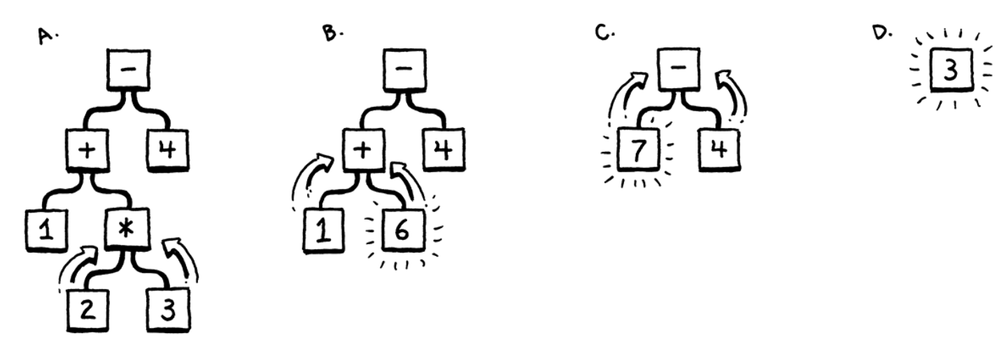

# crafting_interpreters_notes
My personal notes and code while following along in the Crafting Interpreters book.

Implementation notes (all from project root dir):

* Before compiling the Java Lox project, compile and execute this script to generate the `Expr.java` file if changes have been made to the `GenerateAst.java` file:
    * `javac com/craftinginterpreters/tool/GenerateAst.java`
    * `java com.craftinginterpreters.tool.GenerateAst com/craftinginterpreters/lox`
* Build out the `com/craftinginterpreters/lox/Lox.java` path
* Compile with `javac com/craftinginterpreters/lox/Lox.java`
* Execute with `java com.craftinginterpreters.lox.Lox [source-code-file]`
    * `[source-code-file]` is optional. Omitting it will enter the REPL in the terminal.


## Scanning

The scanner (aka "lexer") is responsible for reading each character of the raw text source code file (or REPL input) and converting that into Tokens to be used by the Parser in the next phase. Much of the scanner is simply a glorified switch statement with some extra logic. 

Part of that extra logic there disambiguates between the different types of tokens (e.g. recognizing a `<=` operator instead of a `<` and `=` separately). This is an example of the **maximal munch** principle.

> When two lexical grammar rules can both match a chunk of code that the scanner is looking at, *whichever one matches the most characters wins.*

Most of the time, we "consume" a character when reading the source code (i.e. through the `advance()` method). In order to satisfy the maximal munch principle, we sometimes need to peek ahead of the next character to determine the operator, identifier, or literal that is being referred to in the code. This is what the `peek()` and `peekNext()` methods are for.

> Maximal munch means we can't easily detect a reserved word until we've reached the end of what might instead be an identifier.

### Reflections

It makes much more sense now why an identifier such as a variable can't start with a number of symbol (other than `_`) in most languages. It would add a lot more complexity to identifying numeric literals. If I add `42x` to my source code, should this be flagged as a Lexical Error because the numeric literal contains an alpha character? Or should this be interpreted as an identifier by that name?

### Challenge 4 - nested block comments

I chose to take on the challenge of nested C-style block comments (`/* ... */`). I counted the occurrences of `/*` to keep track of how many layers of nesting I'm in at any given point. The tricky thing here is to make sure that I handle calling an extra `advance()` when my block comment counter gets to zero so that I consume the final `/`. Otherwise, the Scanner will add an errant `SLASH` token to the TokenArray of the program.

I, personally, find the nested comment blocks to be confusing when eventually writing JLox. It makes more sense for any instance of `*/` to end the block comment regardless of how many instances of `/*` there were. But I will leave the nested logic in my implementation for now.


## Representing Code (ch5)

The grammar of the Scanner was simple enough to only require a "Regular" language (in reference to the [Chomsky hierarchy](https://en.wikipedia.org/wiki/Chomsky_hierarchy), yes, _that_ Chomsky). In order to implement the parser, we'll need to go one step up in complexity and functionality, which will be a **context-free grammar** (CFG).

At this point it's useful to review what alphabet and string mean in each context so far along with which component implements that grammar.


| **Terminology**            | **Lexical grammar** | **Syntactic grammar** |
|----------------------------|---------------------|-----------------------|
| The "alphabet" is...       | Characters          | Tokens                |
| A "string" is...           | Lexeme or token     | Expression            |
| It's implemented by the... | Scanner (lexer)     | Parser                |


The Scanner looked at a linear sequence of tokens with an occasional one or two character "look-ahead". The Parser will allow for an arbitrarily deep nesting of expressions, which is why we need to move up to context-free grammar.

When considering an arithmetic expression such as `1 + 2 * 3 - 4`, it can be useful for format the order of operations into a tree:




> A formal grammar’s job is to specify which strings are valid and which aren’t. If we were defining a grammar for English sentences, “eggs are tasty for breakfast” would be in the grammar, but “tasty breakfast for are eggs” would probably not.


## Ch 6 Parsing

The final non-ambiguous grammar from this chapter looks like:

```
expression  -> equality;
equality    -> comparision ( ( "!=" | "==" ) comparison )* ;
comparison  -> term ( ( ">" | ">=" | "<" | "<=" ) term )* ;
term        -> factor ( ( "+" | "-" ) factor )* ;
factor      -> unary ( ( "!" | "-" ) unary )* ;
unary       -> ( "!" | "-" ) unary
             | primary ;
primary     -> NUMBER | STRING | "true" | "false" | "nil"
             | "(" expression ")" ;
```

We had to be careful of a few gotchas when it came to left-recursion.

Here's an example of converting a grammar rule into code.

```
equality       → comparison ( ( "!=" | "==" ) comparison )* ;
```

Think about how we would handle `( ... )*` in code. We need it to be able to find an arbitrarily high count of that occurrence. So we need a `while` loop.

```java
  private Expr equality() {
    Expr expr = comparison();

    while (match(BANG_EQUAL, EQUAL_EQUAL)) {
      Token operator = previous();
      Expr right = comparison();
      expr = new Expr.Binary(expr, operator, right);
    }

    return expr;
  }
```


### Challenges

**Challenge 1 and 2**

The `comma` operator is simple enough. But the `ternary` operator is giving me a bit more trouble. Here is the revised grammar I've come up with so far that includes both the `comma` and `ternary` rules.


```
comma       -> expression (, expression )* ;
expression  -> ternary ;
ternary     -> equality ( "?" ternary ":" ternary )*
            | equality ;
equality    -> comparision ( ( "!=" | "==" ) comparison )* ;
comparison  -> term ( ( ">" | ">=" | "<" | "<=" ) term )* ;
term        -> factor ( ( "+" | "-" ) factor )* ;
factor      -> unary ( ( "!" | "-" ) unary )* ;
unary       -> ( "!" | "-" ) unary
             | primary ;
primary     -> NUMBER | STRING | "true" | "false" | "nil"
             | "(" expression ")" ;
```

My `ternary` rule is right-recursive, which should be fine. But I'm not sure which `Expr` sub class to use to represent it. I ended up creating my own `Ternary` subclass which has the following constructor signature: `Ternary(Expr predicate, Expr if_true, Expr if_false)`. I'm fairly happy with that, but I have no idea how a Ternary operator should appear in the Syntax tree or how that would impact the `AstPrinter` or `ReversePolish` visitors.

I suspect this will make more sense once we implement if statements and I get to see how those are represented in a syntax tree.

This [SO Post](https://stackoverflow.com/questions/65627247/right-associativity-of-ternary-operator) talks about how assicativity doesn't directly tell you exactly the order in which each operator will be evaluated. It simply gives you the rules for where to group things into parentheses. That's a little confusing to me, but I believe this comes down to what the compiler is physically doing along with some types of optimizations?

---

**Challenge 3: error productions for binary operators**

> Add error productions to handle each binary operator appearing without a left-hand operand. In other words, detect a binary operator appearing at the beginning of an expression. Report that as an error, but also parse and discard a right-hand operand with the appropriate precedence.

These are my current grammar rules for each binary operator:

```
equality    -> comparision ( ( "!=" | "==" ) comparison )* ;
comparison  -> term ( ( ">" | ">=" | "<" | "<=" ) term )* ;
term        -> factor ( ( "+" | "-" ) factor )* ;
factor      -> unary ( ( "!" | "-" ) unary )* ;
```

I'm honestly a little confused about how to represent the rules for parse errors vs successful parsing. The book says you could add `"+"` for the rules of a unary (so it would be like this: `unary → ( "!" | "-" | "+" ) unary`). But a `+` is not allowed, so that's what you'd consume in the event of an error so you could print something descriptive such as _"`+` is not a valid unary operator"_. But when I look at the rule of that production, it makes me feel like `+` is a valid option for a unary...

I think I'm just going to add these to the code and keep them out of the actual grammar rules.

Let's think about all of our binary operators:

```
!=
==
>
>=
<
<=
+
-
```

The only one of these that I don't believe I can do this for would be `-`, because it also works as a unary operator. In other words, it might be valid for `-` to not have a left hand operand, because it works as both a binary operator and a unary operator.

Now I'm thinking about my lowest precedence (but earliest/highest grammar rule) that involves a binary operator, because that's the spot where I can do this test for all binary operators other than `-`. Currently, that's `equality()`. I'll implement these rules there.
